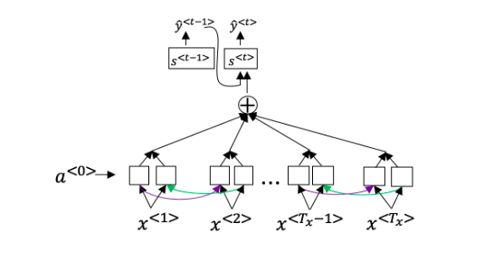

## Course E - Sequence Models

## Week 3 - Sequence Models & Attention Mechanism


1. **Consider using this encoder-decoder model for machine translation.**

   

   **This model is a “conditional language model” in the sense that the encoder portion (shown in green) is modeling the probability of the input sentence x*x*.**

- [ ] True

- [x] False

```
Correct
```

2. **In beam search, if you increase the beam width B*B*, which of the following would you expect to be true? Check all that apply.**

- [x] Beam search will run more slowly.

```
Correct
```

- [x] Beam search will use up more memory.

```
Correct
```

- [x] Beam search will generally find better solutions (i.e. do a better job maximizing *P*(*y*∣*x*))

```
Correct
```

- [ ] Beam search will converge after fewer steps.

3. **In machine translation, if we carry out beam search without using sentence normalization, the algorithm will tend to output overly short translations.**

- [x] True

- [ ] False

```
Correct
```

4. **Suppose you are building a speech recognition system, which uses an RNN model to map from audio clip x*x*to a text transcript y*y*. Your algorithm uses beam search to try to find the value of y*y* that maximizes *P*(*y*∣*x*).**

   **On a dev set example, given an input audio clip, your algorithm outputs the transcript *y*^= “I’m building an A Eye system in Silly con Valley.”, whereas a human gives a much superior transcript y^* =*y*∗= “I’m building an AI system in Silicon Valley.”**

   **According to your model,**

   ***P*(*y*^∣*x*)=1.09∗10−7**

   ***P*(*y*∗∣*x*)=7.21∗10−8**

   **Would you expect increasing the beam width B to help correct this example?**

- [x] No, because *P*(*y*∗∣*x*)≤*P*(*y*^∣*x*) indicates the error should be attributed to the RNN rather than to the search algorithm.

- [ ] No, because *P*(*y*∗∣*x*)≤*P*(*y*^∣*x*) indicates the error should be attributed to the search algorithm rather than to the RNN.

- [ ] Yes, because *P*(*y*∗∣*x*)≤*P*(*y*^∣*x*) indicates the error should be attributed to the RNN rather than to the search algorithm.

- [ ] Yes, because *P*(*y*∗∣*x*)≤*P*(*y*^∣*x*) indicates the error should be attributed to the search algorithm rather than to the RNN.

```
Correct
```

5. **Continuing the example from Q4, suppose you work on your algorithm for a few more weeks, and now find that for the vast majority of examples on which your algorithm makes a mistake, *P*(*y*∗∣*x*)>*P*(*y*^∣*x*). This suggest you should focus your attention on improving the search algorithm.**

- [x] True.

- [ ] False.

```
Correct
```

6. **Consider the attention model for machine translation.**

   

   **Further, here is the formula for *α*&lt;*t*,*t*′>.**

   

   **Which of the following statements about *α*&lt;*t*,*t*′> are true? Check all that apply.**

- [x] We expect *α*&lt;*t*,*t*′> to be generally larger for values of *a*&lt;*t*′> that are highly relevant to the value the network should output for y^{&lt;t>}. (Note the indices in the superscripts.)

```
Correct
```

- [ ] We expect *α*&lt;*t*,*t*′> to be generally larger for values of a^{&lt;t>}*a*&lt;*t*> that are highly relevant to the value the network should output for *y*&lt;*t*′>. (Note the indices in the superscripts.)

- [ ] ∑*t**α*&lt;*t*,*t*′>=1 (Note the summation is over t*t*.)

- [x] ∑*t*′*α*&lt;*t*,*t*′>=1 (Note the summation is over *t*′.)

```
Correct
```

7. **The network learns where to “pay attention” by learning the values *e*&lt;*t*,*t*′>, which are computed using a small neural network:**

   **We can't replace s^{&lt;t-1>}*s*&lt;*t*−1> with s^{&lt;t>}*s*&lt;*t*> as an input to this neural network. This is because s^{&lt;t>}*s*&lt;*t*> depends on *α*&lt;*t*,*t*′> which in turn depends on *e*&lt;*t*,*t*′>; so at the time we need to evalute this network, we haven’t computed s^{&lt;t>}*s*&lt;*t*> yet.**

- [x] True

- [ ] False

```
Correct
```

8. **Compared to the encoder-decoder model shown in Question 1 of this quiz (which does not use an attention mechanism), we expect the attention model to have the greatest advantage when:**

- [x] The input sequence length T\_x is large.

- [ ] The input sequence length T\_x is small.

```
Correct
```

9. **Under the CTC model, identical repeated characters not separated by the “blank” character (\_) are collapsed. Under the CTC model, what does the following string collapse to?**

   **\_\_c\_oo\_o\_kk\_\_\_b\_ooooo\_\_oo\_\_kkk**

- [ ] cokbok

- [x] cookbook

- [ ] cook book

- [ ] coookkboooooookkk

```
Correct
```

10. **In trigger word detection, x^{&lt;t>}*x*&lt;*t*> is:**

- [x] Features of the audio (such as spectrogram features) at time t*t*.

- [ ] The t*t*-th input word, represented as either a one-hot vector or a word embedding.

- [ ] Whether the trigger word is being said at time t*t*.

- [ ] Whether someone has just finished saying the trigger word at time t*t*.

```
Correct
```
